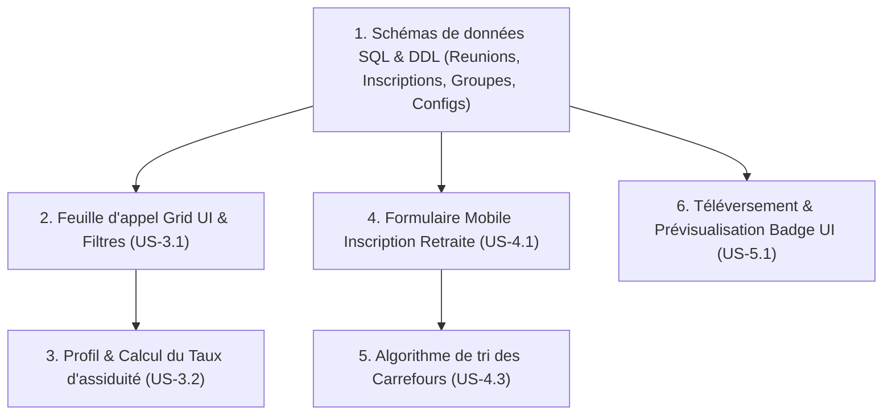

# Plan de Sprint : MIJERCA Cénacle

**Sprint** : Sprint 2 — Administration, Inscriptions & Configuration Logistique  
**Objectif** : Mettre en place les outils d'administration hebdomadaires (suivi des présences), le formulaire d'inscription aux retraites, le premier algorithme de répartition (les carrefours de partage), et le téléversement de fond pour la configuration des badges.  
**Statut** : SPRINT COMPLÉTÉ (Sprint Review)  
**Date** : 13 Juin 2026 au 27 Juin 2026 (Durée : 2 semaines)  
**Auteur** : Winston (Architecte) & John (Product Manager)  

---

## 1. Objectif Clé du Sprint

Permettre aux administrateurs de piloter numériquement les réunions hebdomadaires (check-list de présence tactile), d'ouvrir les inscriptions aux retraites pour les membres, de répartir automatiquement les inscrits dans des carrefours de prière équilibrés (selon l'âge et le genre), et d'importer une image de fond personnalisée pour prévisualiser les futurs badges.

---

## 2. Sélection de Backlog (Sprint 2 Backlog)

| ID Story | Titre de la Story | Priorité | Estimation (points) | Responsable | Statut |
| :--- | :--- | :---: | :---: | :--- | :---: |
| **US-3.1** | Feuille d'Appel Numérique (Admin) | MUST | 1 (S) | Amelia (Dev) | **TERMINE (Done)** |
| **US-3.2** | Fiche d'Assiduité des Membres | MUST | 3 (M) | Amelia (Dev) | **TERMINE (Done)** |
| **US-4.1** | Inscription en ligne aux Retraites | MUST | 1 (S) | Amelia (Dev) | **TERMINE (Done)** |
| **US-4.3** | Répartition Automatique des Carrefours | MUST | 3 (M) | Winston / Amelia | **TERMINE (Done)** |
| **US-5.1** | Configuration de l'Arrière-plan du Badge | MUST | 3 (M) | Amelia (Dev) | **TERMINE (Done)** |

**Total de points planifiés** : 11 Story Points (En deçà de la vélocité maximale de 14 SP pour garantir une validation rigoureuse des algorithmes).

*Note : Les stories US-4.2 (Logement en chambres - 5 SP) et US-5.2 (Génération de PDF badges - 5 SP) sont déplacées au Sprint 3 (Total: 10 SP) pour équilibrer la charge de développement.*

---

## 3. Plan d'Exécution & Séquencement des tâches (Sprint 2)

Pour maximiser l'efficacité d'Amelia, nous préconisons l'enchaînement technique suivant :

---

## 4. Prochaines Étapes pour le Développeur (Amelia)

Pour chaque tâche sélectionnée dans le plan, Amelia devra exécuter le workflow d'implémentation standard :
1. **Création du fichier Story** (`bmad-create-story`) : Préparer les spécifications de la tâche en cours de traitement.
2. **Développement de la Story** (`bmad-dev-story`) : Écrire le code source et les tests.
3. **Revue de code** (`bmad-code-review`) : Faire valider les modifications.
4. **Sprint Status** (`bmad-sprint-status`) : Mettre à jour l'avancement global.
