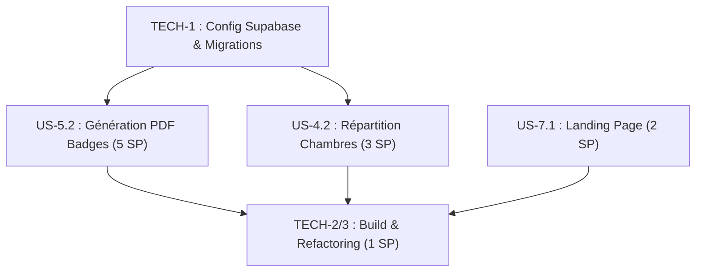

# Plan de Sprint : MIJERCA Cénacle

**Sprint** : Sprint 3 — Badges PDF, Logements & Finalisation MVP  
**Objectif** : Finaliser le module Générateur de Badges (PDF + QR codes) qui est la livraison visible la plus attendue, implémenter l'algorithme de répartition des chambres, et déployer la landing page publique du groupe MIJERCA Cénacle.  
**Statut** : **COMPLÉTÉ ✅**  
**Date** : 27 Juin 2026 au 11 Juillet 2026 (Durée : 2 semaines)  
**Auteur** : Winston (Architecte) & John (Product Manager)  

---

## 1. Objectif Clé du Sprint

Le Sprint 3 représente la **finalisation du MVP** (Minimum Viable Product) de l'application MIJERCA Cénacle :

1. **US-5.2** : L'administrateur peut générer un fichier PDF imprimable contenant tous les badges des participants d'une retraite (fond personnalisé + QR code + carrefour). C'est la fonctionnalité la plus attendue du comité.
2. **US-4.2** : L'algorithme de répartition des chambres (strictement non-mixte, respect des capacités) complète le module logistique retraites.
3. **US-7.1** : Une page d'accueil publique permet au grand public de découvrir la MIJERCA Cénacle avant de créer un compte.
4. **TECH-1** : Configuration du projet Supabase réel (action critique A1 de la rétrospective) pour permettre des tests d'intégration au-delà du mode Démo.

---

## 2. Actions de Rétrospective Intégrées au Sprint

Ces actions issues de la rétrospective Sprint 2 sont intégrées comme tâches techniques dans ce sprint :

| Réf | Action | Intégration dans le Sprint |
| :---: | :--- | :--- |
| A1 | Configurer Supabase dev + appliquer `schema.sql` | Tâche TECH-1 (avant tout dev) |
| A2 | Valider `npm run build` sans erreurs | Tâche TECH-2 (fin de sprint) |
| A4 | Remplacer N UPDATE par `upsert` batch dans `assignCarrefours()` | Inclus dans TECH-3 (refactoring) |
| A5 | Système de migrations SQL numérotées | Inclus dans TECH-1 |
| A6 | Tests unitaires pour `carrefourAlgorithm.js` | Tâche TECH-3 |

---

## 3. Sélection de Backlog (Sprint 3 Backlog)

| ID Story | Titre de la Story | Priorité | Estimation (points) | Responsable | Statut |
| :--- | :--- | :---: | :---: | :--- | :---: |
| **TECH-1** | Configuration Supabase dev & migrations SQL | MUST | 1 (S) | Didier (Admin) | **TERMINE (Done)** |
| **US-5.2** | Génération PDF des Badges & QR Codes | MUST | 5 (L) | Amelia (Dev) | **TERMINE (Done)** |
| **US-4.2** | Répartition Automatique des Logements (Chambres) | MUST | 3 (M) | Amelia (Dev) | **TERMINE (Done)** |
| **US-7.1** | Landing Page Publique MIJERCA Cénacle | MUST | 2 (S) | Amelia (Dev) | **TERMINE (Done)** |
| **TECH-2** | Validation build npm + TECH-3 refactoring | SHOULD | 1 (S) | Amelia (Dev) | **TERMINE (Done)** |

**Total de points planifiés** : 12 Story Points _(Capacité Sprint 3 : 12 SP, conforme à la prévision rétrospective)_

> **Note** : US-6.1 (Notifications Push PWA) — estimée à 3 SP — est déplacée au **Sprint 4** pour ne pas dépasser la capacité. Elle nécessite un abonnement VAPID et une infrastructure Push que le projet Supabase doit d'abord être opérationnel pour tester.

---

## 4. Spécification Technique des Stories

### 🔧 TECH-1 : Configuration Supabase & Migrations (1 SP)

**Tâches** :
1. Créer le projet Supabase de développement sur [supabase.com](https://supabase.com).
2. Créer le fichier `.env` à la racine du projet avec :
   ```
   VITE_SUPABASE_URL=https://xxxx.supabase.co
   VITE_SUPABASE_ANON_KEY=xxxx
   ```
3. Restructurer `db/schema.sql` en migrations numérotées :
   - `db/migrations/001_members.sql`
   - `db/migrations/002_reunions_presences.sql`
   - `db/migrations/003_retreats_registrations.sql`
4. Appliquer les migrations dans Supabase via l'interface SQL Editor.
5. Créer le bucket `retreat-flyers` dans Supabase Storage (Public).

---

### 🪪 US-5.2 : Génération PDF des Badges & QR Codes (5 SP)

**En tant que** : Administrateur  
**Je veux** : Générer un fichier PDF contenant tous les badges imprimables  
**Afin de** : Les distribuer physiquement lors de la retraite.

**Critères d'acceptation** :
- **CA-1** : Le PDF contient un badge par participant au format A6 (148×105mm) ou 4 badges par page A4 (disposition 2×2).
- **CA-2** : Chaque badge affiche : Nom complet, Rôle, Carrefour attribué (ou Commission), et un QR code unique.
- **CA-3** : Le QR code encode l'URL `{app_base_url}/presence/{member_id}` lisible par n'importe quel scanner.
- **CA-4** : L'image de fond du badge (stockée dans `retreats.image_affiche_url`) est chargée et appliquée comme calque inférieur.
- **CA-5** : La génération se fait entièrement côté client (navigateur) via `pdf-lib` et `qrcode` — aucun appel serveur.
- **CA-6** : Le fichier PDF généré se télécharge automatiquement avec le nom `badges_{titre_retraite}.pdf`.
- **CA-7** : En Mode Démo, le PDF est généré avec des données fictives (membres démo + fond placeholder).

**Dépendances npm** :
```json
"pdf-lib": "^1.17.1",
"qrcode": "^1.5.4"
```

**Fichiers** :
- `src/services/pdfGenerator.js` : Logique de génération `pdf-lib` + `qrcode` (module pur)
- `src/components/admin/BadgeGeneratorPanel.jsx` : UI avec bouton de génération, sélecteur de disposition, et indicateur de progression
- Mise à jour `src/App.jsx`

---

### ⛺ US-4.2 : Répartition Automatique des Logements (3 SP)

**En tant que** : Administrateur  
**Je veux** : Affecter automatiquement les inscrits dans les chambres de la retraite  
**Afin de** : Gérer la logistique de logement en 1 clic, sans confusion.

**Critères d'acceptation** :
- **CA-1** : L'admin peut créer des chambres pour une retraite (nom, capacité, genre : M ou F).
- **CA-2** : L'algorithme regroupe les inscrits validés par genre, puis remplit les chambres disponibles jusqu'à leur capacité maximale.
- **CA-3** : Aucun inscrit masculin n'est placé dans une chambre étiquetée F, et vice versa.
- **CA-4** : Si le nombre d'inscrits d'un genre dépasse le total des lits disponibles pour ce genre, une alerte liste les membres non logés.
- **CA-5** : La mise à jour `registrations.room_id` est effectuée via un `upsert` batch unique (action A4 rétrospective).
- **CA-6** : Le tableau récapitulatif affiche : Nom chambre, Capacité, Inscrits affectés, Places restantes.

**Algorithme** (Room-Fill greedy) :
```
ENTRÉE : inscrits validés { genre, nom }, chambres { genre, capacite }
ÉTAPE 1 — Filtrer par genre : hommes → chambres M, femmes → chambres F
ÉTAPE 2 — Trier les chambres par capacité décroissante (remplir les grandes d'abord)
ÉTAPE 3 — Affecter les inscrits chambre par chambre jusqu'à capacité atteinte
ÉTAPE 4 — Inscrits restants → liste d'alerte
```

**Fichiers** :
- `src/utils/roomAlgorithm.js` : Algorithme pur Room-Fill (0 dépendance)
- `src/components/admin/RoomManagementPanel.jsx` : Création de chambres + bouton répartition + tableau
- Méthodes Supabase dans `retreatService.js`

---

### 🌐 US-7.1 : Landing Page Publique MIJERCA Cénacle (2 SP)

**En tant que** : Visiteur non connecté  
**Je veux** : Découvrir le groupe MIJERCA Cénacle sur une page d'accueil publique  
**Afin de** : Comprendre la mission du groupe et savoir comment rejoindre.

**Critères d'acceptation** :
- **CA-1** : La page est accessible sans connexion et différente de l'écran de Login.
- **CA-2** : Elle présente : Logo + Titre "MIJERCA Cénacle", Mission du groupe, Activités (réunions, retraites, méditations), et un bouton "Se connecter / Rejoindre".
- **CA-3** : La page utilise le design système Glassmorphism existant, avec animations d'entrée.
- **CA-4** : La page inclut les balises SEO de base (`<title>`, `<meta description>`, balises Open Graph).
- **CA-5** : Responsive : parfaitement lisible sur mobile (320px) et bureau (1440px).

**Fichiers** :
- `src/components/common/LandingPage.jsx`
- Mise à jour `src/App.jsx` : Afficher `LandingPage` si `!user` au lieu de `LoginPage` directement

---

### 🔧 TECH-2 & TECH-3 : Build + Refactoring (1 SP)

**Tâches** :
1. Exécuter `npm run build` et corriger toutes les erreurs de compilation.
2. Remplacer les N appels `UPDATE` individuels dans `assignCarrefours()` par un seul `upsert` batch.
3. Écrire 3 tests unitaires Jest pour `carrefourAlgorithm.js` :
   - `distributeToCarrefours([])` → retourne `[]`
   - `distributeToCarrefours(registrants, 1)` → un seul groupe avec tous les membres
   - Vérifier équilibre H/F sur 20 membres équirépartis avec 2 carrefours

---

## 5. Plan d'Exécution & Séquencement



**Semaine 1** (27 juin – 4 juillet) :
- TECH-1 : Configuration Supabase (bloquant pour tout test d'intégration)
- US-4.2 : Algorithme Chambres (dépend du service existant `retreatService.js`)
- US-7.1 : Landing Page (indépendante, peut se faire en parallèle)

**Semaine 2** (4 juillet – 11 juillet) :
- US-5.2 : Génération PDF (la plus complexe, réservée à la deuxième semaine)
- TECH-2/3 : Build + refactoring + tests

---

## 6. Critères de Succès du Sprint 3 (Definition of Done)

✅ **Technique** :
- `npm run build` termine sans erreur ni warning critique
- Les 3 tests unitaires `carrefourAlgorithm.test.js` passent
- Le bucket `retreat-flyers` est opérationnel en Supabase
- Toutes les migrations SQL sont appliquées sur l'environnement de dev

✅ **Fonctionnel** :
- L'Admin peut générer et télécharger un PDF de badges avec un vrai fond d'affiche
- Les QR codes du PDF sont lisibles par un smartphone
- L'algorithme de chambres ne mixe aucun genre
- La landing page est accessible sans connexion

✅ **Qualité** :
- Chaque story a une fiche `story_us_*.md` complète avant développement
- Chaque story a une revue de code approuvée dans `code_review_report.md`
- Le Mode Démo fonctionne pour chaque nouvelle fonctionnalité

---

## 7. Risques & Mitigation

| Risque | Probabilité | Impact | Mitigation |
| :--- | :---: | :---: | :--- |
| `pdf-lib` + images base64 trop lent pour > 100 badges | Moyenne | Haut | Générer les badges par lots de 20, afficher une progress bar |
| Bucket Supabase `retreat-flyers` mal configuré (CORS, permissions) | Haute | Haut | Tester l'upload dès TECH-1 avant d'implémenter US-5.2 |
| US-5.2 sous-estimée (5 SP) | Moyenne | Moyen | Si blocage jour 4, reporter la disposition 4/page A4 au Sprint 4 |
| API QR Code en offline (réseau Kinshasa) | Faible | Faible | `qrcode` génère les QR en local (aucun appel réseau) ✅ |
