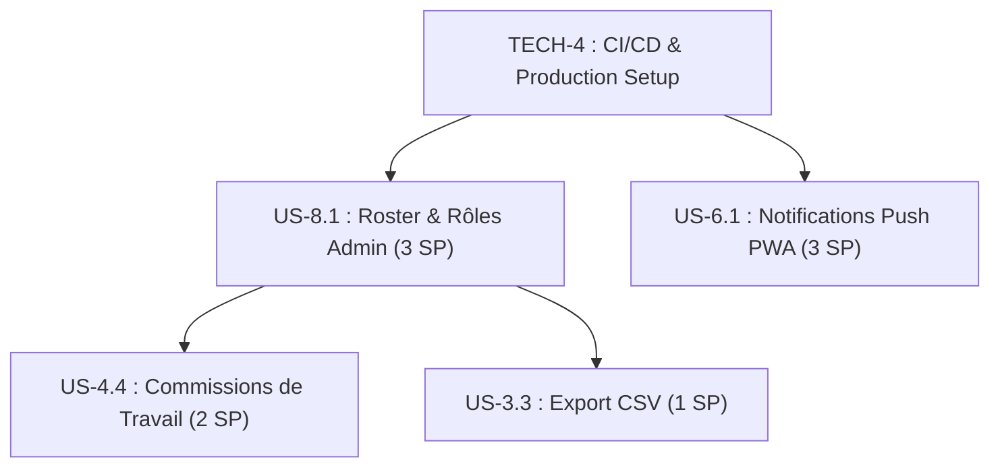

# Plan de Sprint : MIJERCA Cénacle

**Sprint** : Sprint 4 — Notifications Push PWA, Roster Admin & Exportations  
**Objectif** : Implémenter les notifications push PWA pour l'engagement quotidien, ajouter la gestion des commissions de travail pour les retraites, configurer la console admin du roster des membres, permettre l'exportation des feuilles d'appel et sécuriser le déploiement CI/CD en production.  
**Statut** : **PLANIFIÉ 📋**  
**Date** : 11 Juillet 2026 au 25 Juillet 2026 (Durée : 2 semaines)  
**Auteur** : Winston (Architecte) & John (Product Manager)  

---

## 1. Objectif Clé du Sprint

Le Sprint 4 complète les fonctionnalités secondaires et prépare le produit pour son déploiement à grande échelle :

1. **US-6.1** : Les membres reçoivent des notifications push quotidiennes sur leur smartphone (PWA) pour les rappeler de faire leur méditation.
2. **US-8.1** : L'administrateur dispose d'une console dédiée pour gérer le roster global des membres, modifier les rôles (Admin/Responsable/Membre) et désactiver les comptes.
3. **US-4.4** : L'administrateur peut affecter les retraitants validés à des commissions de travail (Liturgie, Logistique, Intercession, etc.), et les responsables de commissions peuvent voir leur équipe.
4. **US-3.3** : L'administrateur peut exporter les rapports de présence aux réunions au format CSV.
5. **TECH-4** : Mise en place d'un pipeline d'intégration continue (GitHub Actions) et configuration des environnements Staging/Production sur Supabase et l'hébergement web.

---

## 2. Actions de Rétrospective Intégrées au Sprint

Ces actions issues de la rétrospective du Sprint 3 sont planifiées sous forme de tâches techniques ou de correctifs :

| Réf | Action | Intégration dans le Sprint |
| :---: | :--- | :--- |
| **A3.1** | Limiter la taille de l'affiche de retraite à 1.5 Mo | Correctif intégré dans l'US-5.1 (Refactoring d'optimisation image) |
| **A3.2** | Préparation de la mise en production Supabase & Hosting | Intégrée dans la tâche **TECH-4** |
| **A3.3** | Planification et implémentation du module de Push PWA | Tâche **US-6.1** |

---

## 3. Sélection de Backlog (Sprint 4 Backlog)

| ID Story | Titre de la Story | Priorité | Estimation (points) | Responsable | Statut |
| :--- | :--- | :---: | :---: | :--- | :---: |
| **US-6.1** | Notifications Push PWA (Web Push & VAPID) | MUST | 3 (M) | Winston / Amelia | **A FAIRE (Todo)** |
| **US-8.1** | Console Admin de Gestion du Roster & Rôles | MUST | 3 (M) | Amelia (Dev) | **A FAIRE (Todo)** |
| **US-4.4** | Gestion des Commissions de Travail | SHOULD | 2 (S) | Amelia (Dev) | **A FAIRE (Todo)** |
| **US-3.3** | Export CSV des Rapports de Présence | SHOULD | 1 (S) | Amelia (Dev) | **A FAIRE (Todo)** |
| **TECH-4** | CI/CD GitHub Actions & Déploiement Production | MUST | 2 (S) | Winston (Arch) | **A FAIRE (Todo)** |

**Total de points planifiés** : 11 Story Points (Conforme à la vélocité cible).

---

## 4. Spécification Technique des Stories

### 🔔 US-6.1 : Notifications Push PWA (3 SP)

**En tant que** : Membre enregistré  
**Je veux** : Recevoir une notification push sur mon téléphone chaque matin  
**Afin de** : M’inviter à lire la méditation quotidienne du Cénacle.  

**Critères d'acceptation** :
- **CA-1** : L'utilisateur se voit proposer l'abonnement aux notifications via une bannière non-intrusive sur l'espace Mobile.
- **CA-2** : Les abonnements de notification (PushSubscription JSON) sont sauvegardés en BDD dans une table `public.push_subscriptions` liée à `member_id`.
- **CA-3** : Un service de backend léger (Edge Function Supabase) est configuré avec des clés VAPID pour pousser les messages.
- **CA-4** : Le Service Worker PWA intercepte l'événement `push` et affiche la notification avec le titre "Méditation du jour 📖" et le verset clé.
- **CA-5** : Cliquer sur la notification ouvre l'application directement sur le lecteur de méditations.

---

### 🛡️ US-8.1 : Console de Gestion du Roster & Rôles (3 SP)

**En tant que** : Administrateur  
**Je veux** : Gérer la liste de tous les membres et modifier leurs privilèges  
**Afin de** : Maintenir l'annuaire du groupe et nommer de nouveaux administrateurs.

**Critères d'acceptation** :
- **CA-1** : Un nouvel onglet "Roster des Membres" est visible sur la console d'administration.
- **CA-2** : Affiche un tableau avec le nom, prénom, email, téléphone, et rôle actuel de chaque utilisateur inscrit.
- **CA-3** : L'admin peut changer le rôle d'un membre via un menu déroulant (Membre, Responsable, Admin) avec sauvegarde immédiate.
- **CA-4** : L'admin peut désactiver temporairement un compte (bloquant la connexion de l'utilisateur).
- **CA-5** : Recherche instantanée et filtre par rôle.

---

### 🎨 US-4.4 : Gestion des Commissions de Travail (2 SP)

**En tant que** : Administrateur / Responsable  
**Je veux** : Assigner les retraitants à des commissions de service et permettre aux responsables de voir leur équipe  
**Afin de** : Coordonner le service (Accueil, Liturgie, etc.) pendant la retraite.

**Critères d'acceptation** :
- **CA-1** : Dans l'onglet Retraites de la console d'administration, l'admin peut associer un membre validé à une commission de service (champ `registrations.commission`).
- **CA-2** : Les commissions disponibles sont : "Accueil", "Logistique", "Intercession", "Liturgie", "Protocoles", "Santé".
- **CA-3** : Un utilisateur ayant le rôle `Responsable` d'une commission spécifique voit un onglet "Ma Commission" dans son espace mobile, affichant la liste de son équipe et leurs coordonnées.
- **CA-4** : En Mode Démo, des commissions d'exemples sont pré-assignées pour vérification visuelle.

---

### 📄 US-3.3 : Export CSV des Rapports de Présence (1 SP)

**En tant que** : Administrateur  
**Je veux** : Télécharger les rapports de présence hebdomadaires sous format CSV  
**Afin de** : Les conserver localement ou faire des analyses croisées sur Excel.

**Critères d'acceptation** :
- **CA-1** : Un bouton "Exporter en CSV" est présent sur le panneau de pointage des présences.
- **CA-2** : L'export génère un fichier contenant : Date réunion, Nom, Prénom, Statut (Présent/Absent), Rôle.
- **CA-3** : Le téléchargement du fichier `presence_[date].csv` se fait instantanément côté client.

---

### 🔧 TECH-4 : CI/CD GitHub Actions & Déploiement Production (2 SP)

**Tâches** :
1. Créer le fichier `.github/workflows/ci.yml` pour compiler le projet et lancer les tests unitaires (`npm run build` et `npx vitest run`) à chaque Pull Request.
2. Créer l'environnement de production sur Supabase.
3. Appliquer toutes les migrations SQL numérotées sur l'instance de production.
4. Mettre en place les secrets et clés de production dans les variables d'environnement de la plateforme d'hébergement.

---

## 5. Plan d'Exécution & Séquencement (Sprint 4)

---

## 6. Critères de Succès du Sprint 4 (Definition of Done)

✅ **Technique** :
- `npm run build` et les tests unitaires passent dans le workflow GitHub Actions.
- La clé secrète VAPID est correctement gérée dans les variables d'environnement.
- Aucun appel réseau inutile n'est effectué pour les exports CSV (tout est traité en mémoire client).

✅ **Fonctionnel** :
- Les notifications Push s'affichent sur mobile lorsque l'application est en arrière-plan.
- L'administration peut changer les rôles avec répercussion directe sur les droits d'accès Supabase.
- Les fichiers CSV générés s'ouvrent sans problème d'encodage (support des accents français).

---

## 7. Risques & Mitigation

| Risque | Probabilité | Impact | Mitigation |
| :--- | :---: | :---: | :--- |
| Permissions Push refusées par l'utilisateur sur mobile | Haute | Faible | Afficher un guide pédagogique expliquant l'intérêt spirituel des notifications avant de demander la permission du navigateur. |
| Incompatibilité des notifications Push sur iOS (Safari mobile) | Moyenne | Moyen | Fournir une alternative de rappel par SMS ou configurer les exigences requises pour iOS PWA (ajout préalable à l'écran d'accueil). |
