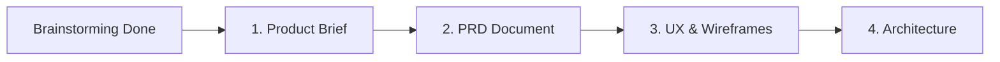

# Session de Brainstorming : MIJERCA Cénacle

**Projet** : Application Web de Gestion et d'Engagement Communautaire  
**Paroisse** : Saint Charles Lwanga (Kinshasa-Bandalungwa, RDC)  
**Utilisateur Principal (Client)** : Didier  
**Date de démarrage** : 13 Juin 2026  

---

## 1. Cadre de l'Idée (Étape 1)

### Vision & Concept
MIJERCA Cénacle est une application web double facette :
1. **Orientée Mobile (PWA/Responsive)** : Destinée aux jeunes du groupe pour soutenir leur vie spirituelle au quotidien (méditations, prières, calendrier) et faciliter leur participation aux réunions et retraites.
2. **Orientée Bureau (Desktop/Web)** : Un portail administratif pour le comité de gestion afin de piloter les effectifs, les réunisons hebdomadaires et la logistique complexe des retraites.

---

## 2. Analyse Jobs-to-be-Done (JTBD) & Structuration Minto (Étape 2)

### A. Analyse des Personas & Besoins (JTBD)

#### 🧑‍💼 Pour les Membres (Jeunes du Cénacle)
* **Job Fonctionnel Principal** : Vivre sa foi au quotidien et s'inscrire facilement aux activités (réunions et retraites) du groupe.
  * *Sous-tâche 1* : Accéder chaque jour à la méditation audio et au texte biblique du jour.
  * *Sous-tâche 2* : Être notifié des programmes de prière journaliers.
  * *Sous-tâche 3* : S'inscrire à une retraite, connaître son logement et son carrefour (groupe de partage) attribué, et récupérer son badge.
  * *Sous-tâche 4* : Valider sa présence lors des réunions hebdomadaires.
* **Job Émotionnel** : Se temps spirituellement accompagné tout au long de la semaine (pas seulement le dimanche) et se sentir pleinement intégré dans la communauté des jeunes.

#### 👥 Pour les Administrateurs (Comité de Gestion)
* **Job Fonctionnel Principal** : Gérer efficacement la vie du groupe et la logistique complexe des événements.
  * *Sous-tâche 1* : Enregistrer et suivre l'assiduité des membres (présences).
  * *Sous-tâche 2* : Gérer les inscriptions aux retraites, attribuer les chambres/logements et les carrefours de prière.
  * *Sous-tâche 3* : Distribuer et suivre la remise des badges de retraite.
  * *Sous-tâche 4* : Diffuser le calendrier des événements et publier les méditations.
* **Job Émotionnel** : Éliminer la surcharge mentale et administrative liée à l'utilisation de fiches papier ou de fichiers Excel éparpillés. Avoir l'esprit tranquille quant à l'organisation logistique.

---

## 3. Choix Technologiques & Fonctionnels Retenus (Étape 3)

### 📋 1. Gestion des Présences
* **Solution retenue : Feuille d'appel numérique (Admin-côté)**.
* **Fonctionnement** : Durant la réunion hebdomadaire, les administrateurs accèdent à l'interface administrative sur mobile/PC, parcourent la liste des jeunes du groupe et cochent les présents en un clic. L'historique d'assiduité est automatiquement mis à jour.

### 🔔 2. Système de Notifications & Méditations
* **Solution retenue : Push Web (PWA) + Partage WhatsApp + Hors-ligne**.
* **Notifications Push** : Intégrées via l'API Web Push pour les téléphones Android/iOS ayant installé la PWA, alertant les jeunes des programmes de prière du jour.
* **Intra-app** : Un centre de notifications dans l'application regroupe les rappels de prière historiques.
* **Partage WhatsApp** : Un bouton de partage rapide permet à tout administrateur ou membre d'envoyer le texte/audio de la méditation directement dans les groupes WhatsApp officiels du Cénacle.
* **Mode Hors-ligne (Offline)** : L'application met automatiquement en cache les textes bibliques et les fichiers audio des méditations de la semaine en cours. Si le jeune n'a plus de réseau ou d'électricité, il peut toujours écouter et lire sa méditation quotidienne.

### ⛺ 3. Logistique des Retraites
* **Répartition Automatique** : Un algorithme répartit automatiquement les retraitants inscrits :
  * **Logement** : Répartition selon le genre (chambres non mixtes) et éventuellement par tranche d'âge si spécifié.
  * **Carrefours (Groupes de partage)** : Répartition mixte et équilibrée selon l'âge et le genre pour favoriser les échanges.
* **Générateur de Badges PDF** :
  * **Personnalisation visuelle** : L'administrateur peut téléverser une image de fond (correspondant à l'affiche/flyer officiel de la retraite).
  * **Contenu dynamique par participant** :
    * *Jeunes* : Nom, Rôle, QR Code unique, et son Carrefour de prière attribué.
    * *Responsables / Encadreurs* : Nom, Rôle, QR Code unique, et sa Commission (ex. Accueil, Intercession, Logistique).
  * Le PDF généré contient toutes les pages prêtes pour impression directe.

---

## 4. Architecture Globale Recommandée

* **Frontend** : **React.js + Vite** configuré en **Progressive Web App (PWA)** pour l'installation sur écran d'accueil et le support offline.
* **Design & UI** : Style moderne, responsive et fluide (optimisé mobile pour les jeunes, agréable sur PC pour les admins).
* **Backend/Base de données** : Une solution comme **Supabase** ou **Firebase** qui facilite :
  * Le stockage des audios (Bucket Storage).
  * La synchronisation en temps réel et la gestion du cache local (Firestore/Supabase client).
  * La gestion simple de l'authentification (Membres vs Admins).

---

## 5. Prochaines Étapes BMad

Pour formaliser le projet et en verrouiller le périmètre précis, nous devons générer le **Product Brief** (`bmad-product-brief`). Celui-ci regroupera la description globale du projet, les fonctionnalités validées et servira de base pour générer le PRD officiel.
