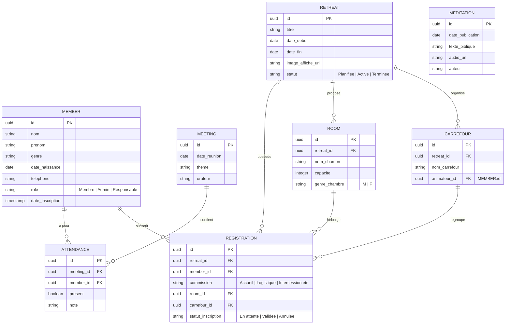

# Product Requirements Document (PRD) : MIJERCA Cénacle

**Projet** : Application Web MIJERCA Cénacle  
**Version** : 1.0.0  
**Statut** : En cours de validation  
**Date** : 13 Juin 2026  
**Auteur** : John (Product Manager)  

---

## 1. Résumé Exécutif & Vision

L'application **MIJERCA Cénacle** vise à moderniser la gestion administrative et spirituelle du groupe des jeunes du Renouveau charismatique catholique de la paroisse Saint Charles Lwanga (Kinshasa-Bandalungwa, RDC). 

L'application combine une interface utilisateur mobile ( Progressive Web App ) pour l'engagement spirituel quotidien et le fonctionnement hors ligne, avec une console d'administration sur ordinateur pour la gestion des présences et la logistique des retraites (inscriptions, chambres, carrefours, badges PDF).

---

## 2. Rôles et Droits (Matrice de Sécurité)

| Rôle | Description | Droits d'Accès |
| :--- | :--- | :--- |
| **Visiteur (Grand Public)** | Toute personne externe | Landing page, calendrier des événements publics. |
| **Membre (Jeune du Cénacle)** | Jeune membre du groupe enregistré | Accès aux méditations, historique personnel, inscription aux retraites, affichage de son logement/carrefour. |
| **Responsable / Encadreurs** | Responsables de commissions | Droits identiques au Membre + accès en lecture à sa commission de retraite spécifique. |
| **Administrateur** | Comité de gestion de la MIJERCA | Droits complets : gestion des membres, pointage des présences, configuration des retraites, répartition automatique, génération de badges. |

---

## 3. Liste des Exigences Fonctionnelles (Matrice MoSCoW)

### 3.1. Module Vie Spirituelle (Mobile/PWA)
* **PRD-F-001 [MUST]** : Affichage quotidien du texte biblique et lecture du fichier audio de la méditation.
* **PRD-F-002 [MUST]** : Mode Hors-Ligne (Caching local des audios et textes de la semaine via Service Worker).
* **PRD-F-003 [MUST]** : Bouton de partage rapide sur WhatsApp pour diffuser la méditation.
* **PRD-F-004 [SHOULD]** : Notifications Push (Web Push PWA) pour les programmes de prière quotidiens.

### 3.2. Module Réunions Hebdomadaires
* **PRD-F-005 [MUST]** : Liste d'appel numérique (côté admin) pour cocher la présence des membres en un clic.
* **PRD-F-006 [MUST]** : Historique des présences par membre consultable par les administrateurs.
* **PRD-F-007 [COULD]** : Export Excel/CSV des rapports de présence.

### 3.3. Module Inscriptions & Logistique Retraites
* **PRD-F-008 [MUST]** : Formulaire d'inscription en ligne pour les retraites de jeunes.
* **PRD-F-009 [MUST]** : Répartition automatique des participants dans les logements par genre (strictement non-mixte).
* **PRD-F-010 [MUST]** : Répartition automatique dans les carrefours de prière avec équilibrage par âge et genre.
* **PRD-F-011 [SHOULD]** : Gestion des commissions de travail pour les responsables/encadreurs.

### 3.4. Module Générateur de Badges PDF
* **PRD-F-012 [MUST]** : Téléversement d'un fichier image (fond de badge personnalisé avec le design de l'affiche).
* **PRD-F-013 [MUST]** : Génération d'un fichier PDF contenant tous les badges prêts à être imprimés.
* **PRD-F-014 [MUST]** : Chaque badge doit afficher : Nom complet, Rôle, QR Code unique de présence, et Carrefour (pour les jeunes) OU Commission (pour les encadreurs).

### 3.5. Module Vitrine & Administration
* **PRD-F-015 [MUST]** : Page d'accueil publique (Landing Page) décrivant le groupe MIJERCA Cénacle.
* **PRD-F-016 [MUST]** : Console d'administration sécurisée pour le roster des membres et la gestion des rôles.

---

## 4. Spécification Détaillée des Fonctionnalités Clés

### 4.1. Algorithme de Répartition Automatique (Retraites)
Lors du clic sur "Lancer la répartition" par l'Administrateur :
1. **Chambres (Logements)** :
   * Regrouper les inscrits validés par Genre.
   * Remplir les chambres disponibles affectées à ce genre jusqu'à leur capacité maximale.
   * Lever une alerte si le nombre de places est insuffisant pour un genre donné.
2. **Carrefours (Groupes de prière)** :
   * Déterminer le nombre de carrefours à créer (ex. $N = \text{total inscrits} / 10$).
   * Répartir de manière homogène les genres et les tranches d'âge dans chaque carrefour pour s'assurer qu'aucun groupe ne contienne que des personnes d'un même profil.

### 4.2. Générateur de Badges PDF
* **Format physique recommandé** : A6 (ou 4 badges par page A4 pour faciliter la découpe).
* **Superposition des calques** :
  * *Calque inférieur* : L'image d'affiche téléversée par l'admin (mise à l'échelle pour couvrir le fond du badge).
  * *Calque supérieur* : Données textuelles (Nom en gras, Rôle en couleur contrastée, Carrefour/Commission) disposées sur une zone semi-transparente pour garantir la lisibilité sur n'importe quel fond.
  * *QR Code* : Placé dans un angle avec une marge blanche pour assurer la scannabilité.

### 4.3. Support Hors-Ligne (Offline Caching)
* Utilisation de **IndexedDB** ou **LocalForage** pour stocker les métadonnées des méditations textuelles.
* Utilisation du **Cache Storage API** pour stocker les fichiers audio `.mp3`.
* Le Service Worker intercepte les requêtes réseau vers les fichiers audio. S'il n'y a pas de réseau, il sert directement le fichier depuis le cache local.

---

## 5. Modèle Logique de Données (MCD)

---

## 6. Exigences Non Fonctionnelles

1. **Vitesse et Fluidité** : Chargement de la page d'accueil sous mobile en moins de 2 secondes.
2. **Poids de l'application** : Taille totale du bundle de l'app de moins de 5 Mo pour faciliter le téléchargement sur les réseaux mobiles lents.
3. **Sécurité** : Chiffrement SSL/TLS obligatoire. Accès à la console d'administration protégé par authentification forte.
4. **RGPD / Données Personnelles** : Sécurisation des données des jeunes (notamment les dates de naissance et les numéros de téléphone).

---

## 7. Critères d'Acceptation (Exemples pour Validation)

* **Badge PDF** : Le PDF généré doit avoir un ratio correct et ne pas déformer l'image d'affiche importée. Le QR code doit être lisible par un smartphone standard.
* **Mise en cache** : En coupant la connexion Wi-Fi/Données mobiles de l'appareil, l'utilisateur doit pouvoir écouter le fichier audio de la méditation déjà chargée précédemment sans interruption ni message d'erreur.
* **Répartition** : Aucun retraitant masculin ne doit être affecté à une chambre étiquetée féminine (F) et vice-versa.
