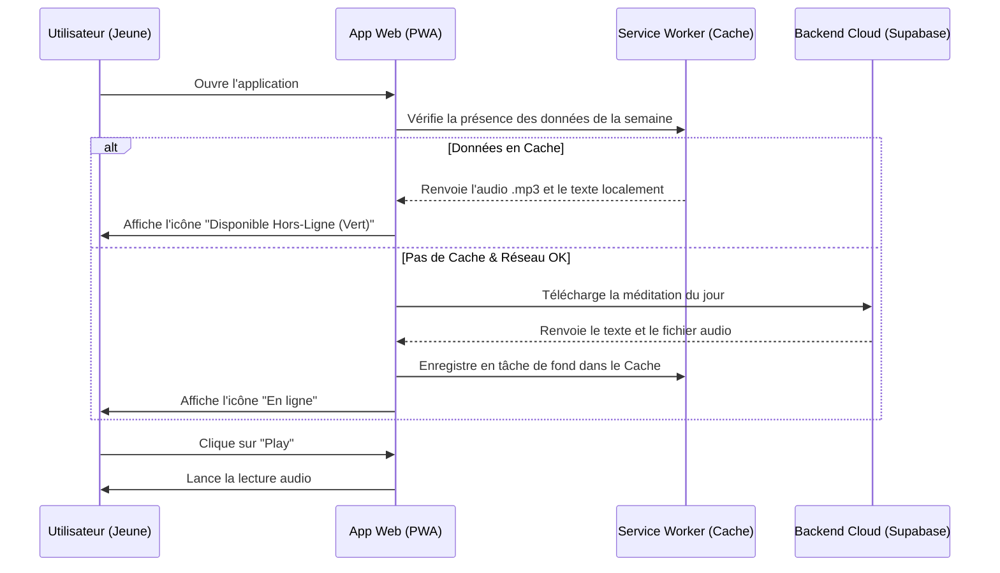

# UX/UI Design Specifications : MIJERCA Cénacle

**Projet** : Application Web MIJERCA Cénacle  
**Version** : 1.0.0  
**Statut** : En cours de validation  
**Date** : 13 Juin 2026  
**Auteur** : Sally (UX Designer)  

---

## 1. Direction Artistique & Système de Design

L'esthétique de l'application MIJERCA Cénacle allie la solennité spirituelle du Renouveau Charismatique Catholique à un design d'application moderne, épuré et premium (style Glassmorphism avec des dégradés subtils).

### 🎨 Palette de Couleurs

* **Couleur Primaire (Spiritual Purple)** : `#4F1E6F` (Un violet profond et royal évoquant la prière, la liturgie et l'esprit).
* **Accent (Sacred Gold)** : `#E6C229` (Un doré éclatant et chaleureux représentant l'Esprit Saint, la lumière et la fête).
* **Arrière-plan Sombre (Midnight Slate)** : `#0E0B16` (Un gris très sombre et bleuté pour le mode sombre par défaut, évitant le noir pur pour un effet plus doux).
* **Arrière-plan Clair (Off-White)** : `#FDFBFF` (Un blanc très légèrement teinté de violet pour le mode clair).
* **Statut Réussite/Cache** : `#2EC4B6` (Un vert-menthe moderne indiquant qu'un fichier est disponible hors ligne).

```
[Violet Primaire]  ████████████ #4F1E6F
[Doré Accent]      ████████████ #E6C229
[Fond Sombre]      ████████████ #0E0B16
[Succès / Cache]   ████████████ #2EC4B6
```

### ✍️ Typographie
* **Titres** : `Outfit` (Google Fonts) - Une police géométrique, chaleureuse et moderne.
* **Corps de texte** : `Inter` (Google Fonts) - Très lisible, optimisée pour les écrans de smartphones.

---

## 2. Parcours Utilisateur Critiques (Flux Mobiles)

### 2.1. Écoute de la Méditation Quotidienne (Mode Connecté ou Hors-Ligne)



---

## 3. Wireframes des Écrans Clés (Maquettes Conceptuelles)

### 3.1. Vue Mobile : Dashboard & Méditation du Jour (Jeune)
L'interface mobile utilise des cartes à effet verre dépoli (Glassmorphism) superposées sur un arrière-plan sombre avec un gradient violet subtil en fond.

```
+-------------------------------------------------+
|  [MIJERCA CENACLE]                 (☀️/🌙) [Menu] |
+-------------------------------------------------+
|  Bienvenue Didier !                             |
|                                                 |
|  +-------------------------------------------+  |
|  | MÉDITATION DU JOUR                 [Cache] |  |
|  | "L'Esprit Saint descendra sur vous..."    |  |
|  | Actes 1, 8                                |  |
|  |                                           |  |
|  |   [|||||||||||||||||||| 02:45 / 07:15]    |  |
|  |                                           |  |
|  |     [ Précédent ]  [ > PLAY ]  [ Suivant ] |  |
|  |                                           |  |
|  |   [ Partager sur WhatsApp ]               |  |
|  +-------------------------------------------+  |
|                                                 |
|  +-------------------------------------------+  |
|  | MA PROCHAINE RETRAITE                     |  |
|  | Retraite "Feu de l'Esprit"                |  |
|  | Du 12 au 14 Juillet 2026                  |  |
|  | Logement : Chambre Saint Jean             |  |
|  | Carrefour : Carrefour n°3 (St Pierre)     |  |
|  |                                           |  |
|  |   [ MON BADGE NUMÉRIQUE / QR CODE ]       |  |
|  +-------------------------------------------+  |
+-------------------------------------------------+
```

### 3.2. Vue Bureau : Console d'Administration (Comité de Gestion)
Un tableau de bord épuré permettant de gérer les effectifs et la logistique.

```
+-----------------------------------------------------------------------------------+
|  [MIJERCA ADMIN]   [Membres]  [Présences]  [Retraites]               Admin: Didier |
+-----------------------------------------------------------------------------------+
|                                                                                   |
|  RETRAITE : "FEU DE L'ESPRIT 2026"                                                |
|                                                                                   |
|  +--------------------------+  +-----------------------------------------------+  |
|  | STATISTIQUES             |  | ALLOCATION AUTOMATIQUE                        |  |
|  | * Inscrits : 124 jeunes  |  |                                               |  |
|  | * Hommes : 58  Femmes : 66|  | [ LANCER LA RÉPARTITION DES CHAMBRES & GRPS ] |  |
|  | * Chambres dispo : 15    |  | (Répartit les genres et tranches d'âges)      |  |
|  | * Carrefours requis : 12 |  |                                               |  |
|  +--------------------------+  +-----------------------------------------------+  |
|                                                                                   |
|  +-----------------------------------------------------------------------------+  |
|  | CONFIGURATION DES BADGES IMPRIMABLES                                        |  |
|  |                                                                             |  |
|  |  Image de fond (Affiche officielle) : [ Choisir un fichier... ]             |  |
|  |                                                                             |  |
|  |  [ GÉNÉRER ET TÉLÉCHARGER LE PDF DES BADGES (124) ]                         |  |
|  +-----------------------------------------------------------------------------+  |
+-----------------------------------------------------------------------------------+
```

### 3.3. Vue Bureau : Feuille d'Appel (Séance Hebdomadaire)
L'administrateur coche manuellement la présence des membres de manière très rapide.

```
+-----------------------------------------------------------------------------------+
|  [MIJERCA ADMIN]   [Membres]  [Présences]  [Retraites]               Admin: Didier |
+-----------------------------------------------------------------------------------+
|  FEUILLE D'APPEL - Réunion du Samedi 13 Juin 2026                                 |
|                                                                                   |
|  [ Rechercher un membre... ]                                [ Enregistrer ]       |
|                                                                                   |
|  +------------------------------------+-----------------------+-----------------+  |
|  | Nom complet                        | Rôle / Commission     | Présence        |  |
|  +------------------------------------+-----------------------+-----------------+  |
|  | [ ] Ambunga Didier                 | Membre                |  [ X ] Présent  |  |
|  | [ ] Kabangu Sarah                  | Membre                |  [   ] Absent   |  |
|  | [ ] Mbuyi Jean-Paul                | Responsable (Accueil) |  [ X ] Présent  |  |
|  | [ ] Ngolo Christian                | Membre                |  [   ] Absent   |  |
|  +------------------------------------+-----------------------+-----------------+  |
+-----------------------------------------------------------------------------------+
```

---

## 4. Retours Visuels & Micro-interactions Clés

1. **Indicateur de Cache Offline** : Une icône en forme de petit nuage avec une encoche verte s'affiche sur la carte de la méditation. S'il n'y a pas de réseau et que la méditation n'est pas en cache, l'icône devient rouge et le bouton Play est grisé avec un message explicatif : *"Cette méditation n'est pas disponible hors ligne. Connectez-vous pour la télécharger."*
2. **Audio Waveform Animation** : Pendant la lecture d'une méditation audio, un égaliseur visuel miniature s'anime au rythme de la piste pour indiquer le bon fonctionnement du player.
3. **Badge PDF Custom Preview** : Un mini visualiseur de badge s'affiche à l'écran lors du téléversement du fond d'affiche. Il permet à l'admin de déplacer/ajuster l'opacité de la zone de texte blanche pour s'assurer que les informations restent lisibles sur le motif importé.
